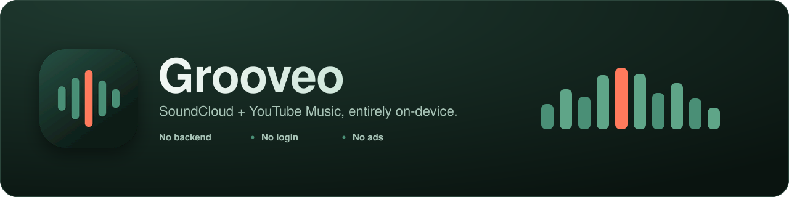
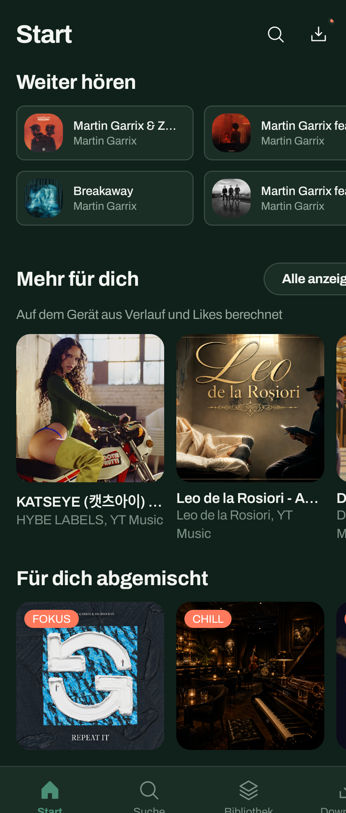
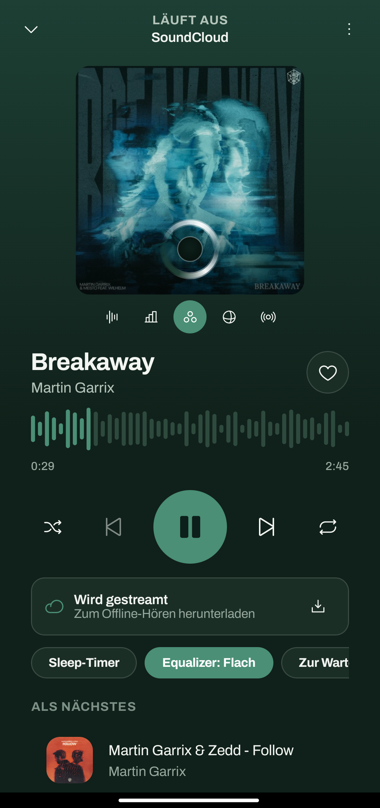
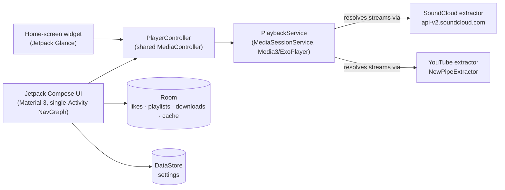

<div align="center">



<p></p>

[](https://github.com/lcbs181/grooveo/actions/workflows/ci.yml)
[](https://github.com/lcbs181/grooveo/releases)
[](LICENSE)
[](gradle/libs.versions.toml)
[](app/build.gradle.kts)
[](CONTRIBUTING.md)

**No backend. No account. No login screen.**
Search, stream, download, like, and organize — all resolved and stored directly on the phone.

</div>

<br>

## Contents

- [Features](#features)
- [Screenshots](#screenshots)
- [Architecture](#architecture)
- [Building](#building)
- [Optional backend link](#optional-backend-link)
- [Known limitations](#known-limitations)
- [Contributing](#contributing)
- [License](#license)

## Features

| | |
|---|---|
| **Search** | Across SoundCloud and YouTube Music — tracks, artists, playlists, and albums, per-source or combined. |
| **Streaming** | Fully on-device. SoundCloud resolves its own signed CDN URLs (native HLS via Media3); YouTube Music resolves through NewPipeExtractor. No server-side proxy, ever. |
| **Downloads** | Offline playback for YouTube tracks (see [Known limitations](#known-limitations)), plus a *Datensparmodus* (data-saver) setting that restricts playback to downloaded tracks only. |
| **Likes & playlists** | Stored locally in Room, with reordering, rename, and bulk-download-a-playlist. |
| **Home** | A *Charts* shelf (global SoundCloud/YouTube trending) and a *Für dich* feed computed entirely on-device from local play history and likes — no server-side aggregation. |
| **Artist pages** | Collapsible bio, top/latest track shelves, and a paginated follower list (SoundCloud). |
| **Player** | Waveform-style seek bar, shuffle/repeat, a sleep timer (15–90 min presets), a 4-band equalizer (Flach/Bass-Boost/Höhen-Boost/Vocal), and a stream/download switch per track. |
| **Home-screen widget** | Jetpack Glance, five size tiers from a 1×2 mini card up to a 3×7 tablet layout — play/pause/skip, now-playing artwork, and an up-next queue at the larger sizes. |
| **Optional update channel** | Point it at the companion backend (see [below](#optional-backend-link)) and the app can check for and install new builds directly, with no Play Store listing. |

## Screenshots

<div align="center">
<table>
<tr>
<td align="center" width="50%"><br><sub><b>Start</b> — on-device charts &amp; recommendations</sub></td>
<td align="center" width="50%"><br><sub><b>Player</b> — waveform seek, equalizer, queue</sub></td>
</tr>
</table>
</div>

## Architecture



- **UI** — Jetpack Compose, Material 3, single-Activity navigation (`ui/navigation/NavGraph.kt`).
- **DI** — Hilt.
- **Playback** — Media3/ExoPlayer via a `MediaSessionService` (`playback/PlaybackService.kt`), controlled through one shared `MediaController` wrapper (`playback/PlayerController.kt`) that every screen — and the home-screen widget — plays through.
- **Extraction** (`data/extract/`):
  - `soundcloud/` — a hand-rolled OkHttp client against SoundCloud's undocumented `api-v2.soundcloud.com`, mirroring the approach yt-dlp's SoundCloud extractor uses (client_id rotation, transcoding resolution). Tracks served exclusively via DRM-encrypted HLS are detected and reported honestly as unplayable rather than silently failing (see `SoundCloudStreamResolver`).
  - `youtube/` — [NewPipeExtractor](https://github.com/TeamNewPipe/NewPipeExtractor) for search, artist channels, and stream resolution.
- **Local storage** — Room (`data/local/`) for the track cache, likes, playlists, and downloads; DataStore for settings.
- **Networking** — a plain OkHttp client for SoundCloud/YouTube extraction, kept deliberately separate from the optional backend-link client (see `data/extract/di/ExtractorModule.kt`) so no credentials ever leak to a third-party host.

## Building

Requires JDK 17 and the Android SDK (`compileSdk`/`targetSdk` 37, `minSdk` 30).

```sh
./gradlew :app:assembleDebug
```

The APK lands at `app/build/outputs/apk/debug/app-debug.apk`.

`local.properties` needs the usual `sdk.dir`; everything else has a working default (see [Optional backend link](#optional-backend-link) for the one optional section).

## Optional backend link

The app works completely standalone. If you also run the companion FastAPI backend (analytics + the update channel — not required for search, streaming, downloads, likes, or playlists), two things need configuring:

1. In-app **Settings**: set "Backend-URL" and "API-Key" to your backend's address and its `API_KEY`.
2. `local.properties` (create once, never committed):
   ```properties
   serviceAccountEmail=you@example.com
   serviceAccountPassword=your-password
   ```
   This is a real account on your backend (created via its own register/invite flow) used for a silent background login — the app never shows a login screen. Analytics events and the update check simply no-op if left blank.

## Known limitations

<details>
<summary>SoundCloud downloads aren't supported</summary><br>

SoundCloud tracks resolve to HLS, which needs segment fetch + remux to download properly; not built yet. Attempting one immediately shows "Fehlgeschlagen" rather than enqueueing doomed work.
</details>

<details>
<summary>Some SoundCloud tracks are DRM-only</summary><br>

A subset of tracks (major-label content observed so far) are served exclusively through DRM-encrypted HLS with no working plain stream — the app detects this and reports it honestly instead of endlessly retrying; there's no DRM/Widevine license exchange implemented, and none is planned.
</details>

<details>
<summary>Very large SoundCloud playlists/albums only play the first batch</summary><br>

They play whatever tracks SoundCloud's API embeds inline in the initial response (typically the first handful) — resolving the rest would need a second batch endpoint with a different response shape than every other call in this app expects.
</details>

<details>
<summary>YouTube "Topic" channels sometimes expose no track list</summary><br>

Auto-generated channels for artists without a manually managed one occasionally expose neither a "Tracks" nor "Videos" tab through NewPipeExtractor's channel model; the app falls back to whatever tab is available, logging what it found for diagnosis if it still comes up empty.
</details>

<details>
<summary>YouTube Music has no real "charts" endpoint</summary><br>

Unlike SoundCloud's genuine trending API, nothing equivalent is reachable through NewPipeExtractor — the Home Charts shelf's YouTube half falls back to the general "Trending" kiosk, filtered by a rough song-length heuristic. Real data, just less precisely curated than the SoundCloud half.
</details>

<details>
<summary>Artist name resolution is best-effort</summary><br>

A track's "Zum Künstler" action only has an artist *name*, not an id, so it resolves via a 1-result search — usually right for well-known artists, not guaranteed on SoundCloud where duplicate-named accounts are common.
</details>

## Contributing

Contributions are welcome — see [`CONTRIBUTING.md`](CONTRIBUTING.md) for setup, code style, and the PR process, and [`docs/`](docs/) for a deeper architecture/development/release writeup. Please also read the [Code of Conduct](CODE_OF_CONDUCT.md).

## License

GPL-3.0-or-later — see [`LICENSE`](LICENSE). This is inherited from the [NewPipeExtractor](https://github.com/TeamNewPipe/NewPipeExtractor) (GPL-3.0-or-later) dependency used for YouTube Music extraction: distributing a build of this app is subject to GPL-3.0's copyleft terms.

<div align="right"><a href="#contents">back to top ↑</a></div>
